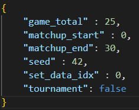

# Projeto graduação (PGC)
Repositório para o projeto de graduação do BCC (Bacharelado Ciência da Computação) na UFABC.

## 📓 Descrição
Implementação de algoritmos de busca adversarial em alguns jogos com objetivo de comparação de desempenho. A comparação será feita por meio de um torneio entre os algoritmos, em que cada jogador executa uma determinada implementação. 

Os principais algoritmos utilizados são: minimax poda alfa-beta, MCTS UCT, MCTS RAVE e Q-Learning. 

## 🕹️ Jogos utilizados

- Jogo da velha ([tic tac toe](https://github.com/KruZZy/tic-tac-toe))
- Jogo da velha estendido ([ultimate tic-tac-toe](https://github.com/VAIBHAV-2303/MonteCarloTreeSearch))
- Connect four ([connect4](https://github.com/KeithGalli/Connect4-Python))
- Damas ([checkers](https://github.com/dimitrijekaranfilovic/checkers)) 

## ⚙️ Execução 

Em cada pasta dos jogos utilizados no projeto contém uma pasta *Algorithms*, em que está a implementação dos algoritmos. 

O script *Program.py* executa o torneio com base no arquivo *config.json*. 

- *game_total*: total de jogos que serão realizados. Por padrão, é aplicado o jogo trocando os jogadores de lado. Assim, esse valor é duplicado na prática. 

- *matchup_start*: número do confronto inicial. Como cada torneio possui vários confrontos, é possível executar apenas uma parte dele. 

- *matchup_end*: número do confronto final. Como cada torneio possui vários confrontos, é possível executar apenas uma parte dele.

- *seed*: número fixo da semente da aleatoriedade. Permite que os resultados dos confrontos sejam replicados.

- *set_data_idx*: índice utilizado na geração das métricas. Utilizado para obter os jogadores na pasta *data* também. 

- *tournment*: indica a realização do torneio. Caso seja falso, cada algoritmo será confrontado com um jogador aleatório, ao invés do confronto entre eles. 

Os torneios podem ser personalizados para executarem apenas alguns ou todos os algoritmos. Para tal, deve alterar o arquivo *players.json* na pasta *data*. 

Para o algoritmo Q-Learning, é necessário treiná-lo antes para gerar a tabela Q. Assim, o script *QLearnTraning.py* realiza o treinamento. 

